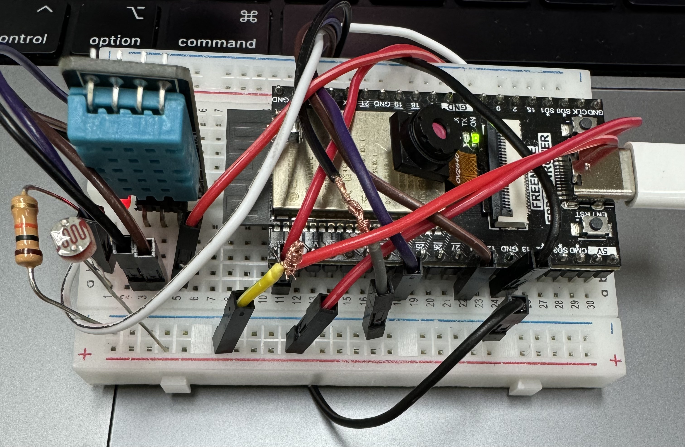
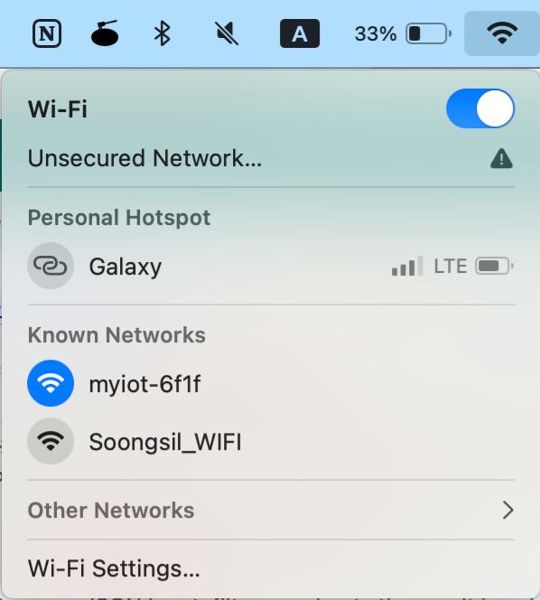
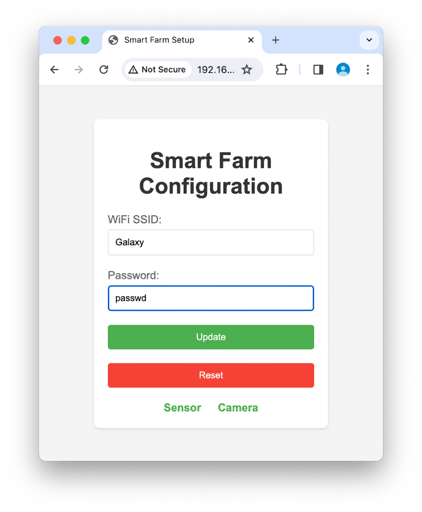
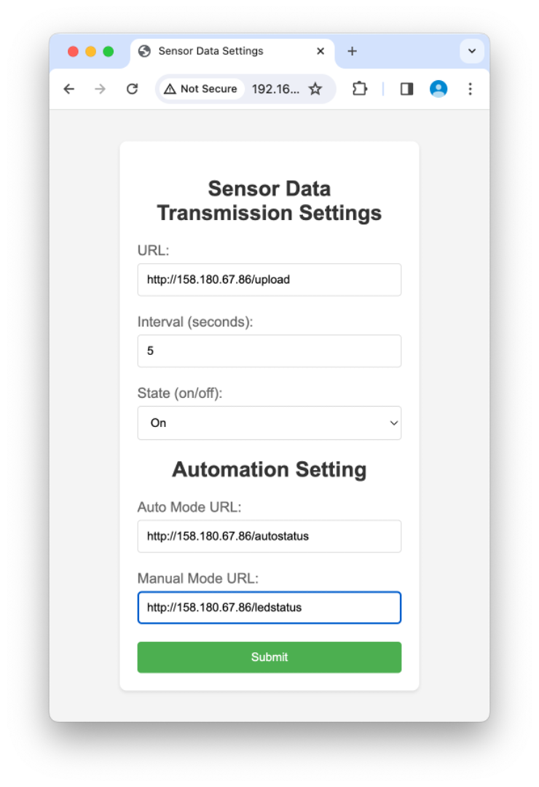
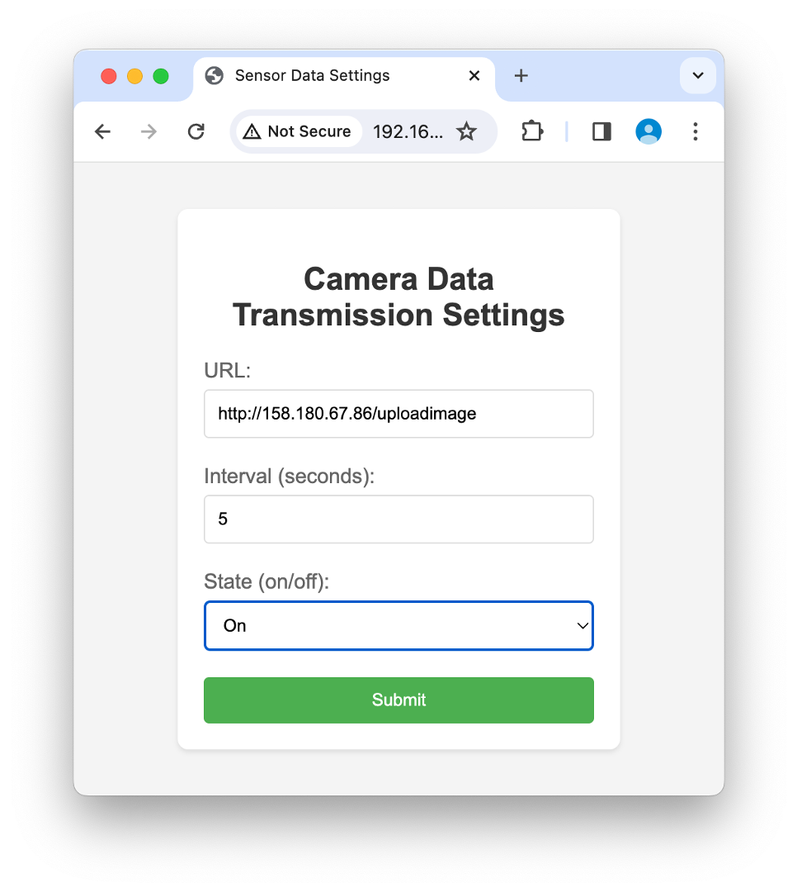

# OURFARM DEVICE with 2023 숭실대학교 webOS 

## 하드웨어 구성

* ESP32-CAM
* DHT11 온습도 센서
* 광량 센서
* LED

## 1. WiFi AP 모드로 접속

ESP32는 초기 구동 시 AP(액세스 포인트) 모드로 설정됩니다.
사용자는 Wi-Fi 설정에서 ESP32의 SSID를 찾아 연결합니다.

## 2. 와이파이 설정 및 인터넷 연결

ESP32에 연결된 후, 웹 브라우저를 사용하여 ESP32의 IP 주소로 접속합니다.
웹 인터페이스를 통해 사용자는 ESP32에 Wi-Fi 네트워크 정보 (SSID 및 비밀번호)를 입력하여 인터넷에 연결할 수 있습니다.

## 3. 센서 데이터를 보낼 웹주소 및 실행주기 설정

웹 인터페이스에서 "센서 설정" 섹션을 통해 센서 데이터를 보낼 웹 주소(URL)와 데이터 전송 주기(초 단위)를 설정합니다.
이 설정은 온도, 습도, 광량 센서의 데이터를 지정된 주소로 전송하는 데 사용됩니다.

## 4. 카메라 데이터를 보낼 웹주소 및 실행주기 설정

웹 인터페이스에서 "카메라 설정" 섹션을 통해 카메라 데이터를 보낼 웹 주소(URL)와 이미지 전송 주기(초 단위)를 설정합니다.
설정된 주기마다 카메라는 사진을 캡쳐하고 지정된 URL로 이미지를 전송합니다.

## 추가 정보
사용자는 웹 인터페이스를 통해 LED 제어 모드(자동/수동)와 실행 주기를 설정할 수 있습니다.
설정된 모드에 따라, ESP32는 주변 광량 센서 데이터를 기반으로 LED를 자동 제어하거나, 웹 인터페이스를 통한 수동 제어를 수행할 수 있습니다.